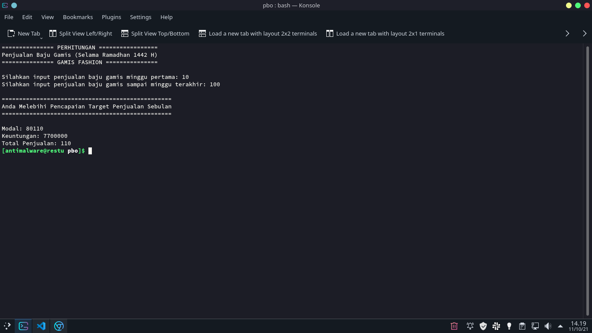
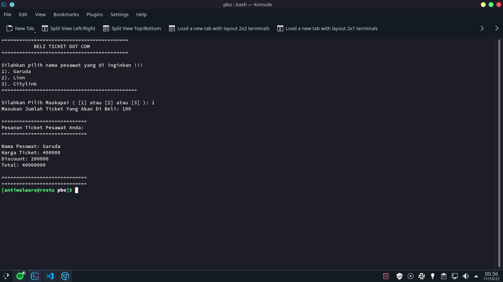

# Golang Scanner

Contoh pembuatan aplikasi Java menggunakan BlueJ [cek disini](https://github.com/restuwahyu13/java-with-bluej), tetapi berikut ini adalah versi rebuild dari Java ke Golang, dengan menggunakan konsep yang sama yaitu dengan menggunakan Scanner.

## Command

```sh
$ make start name=f<app name> || go run <app name>/main.go
```

## Implementation Case

- Toko
- Ticket
- Sekolah

## Ticket App Scanner



## Ticket App Scanner



## Sekolah App Scanner


